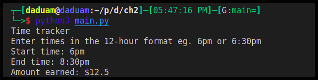

# Time-tracking Program

## Documentation

### Description
This program takes two inputs, start and end of the period, and calculates the amount earned using an hourly rate of $5

### Running and Requirements
- The only requirement to run this program is to have `python 3` interpreter installed on your computer
- To run, clone this repository and run the main script using the python interpreter from your terminal.
```sh
python3 main.py
```
- The input times should be given in the 12-hour format. This screenshot from an example run


### Design and Implementation
The program flows linearly from start to finish.
- User inputs start and end times
- The hour interval between the two times is calculated
- The hour interval is multiplied by an hourly rate of $5
- The user is presented with the total amount earnable
- User input and calculated values are stored in a csv file for future reference

The program is implemented with the python standard library. It implements a bunch of functions that perform select tasks.

All of these small tasks are brought together in the main function which drives the program execution.